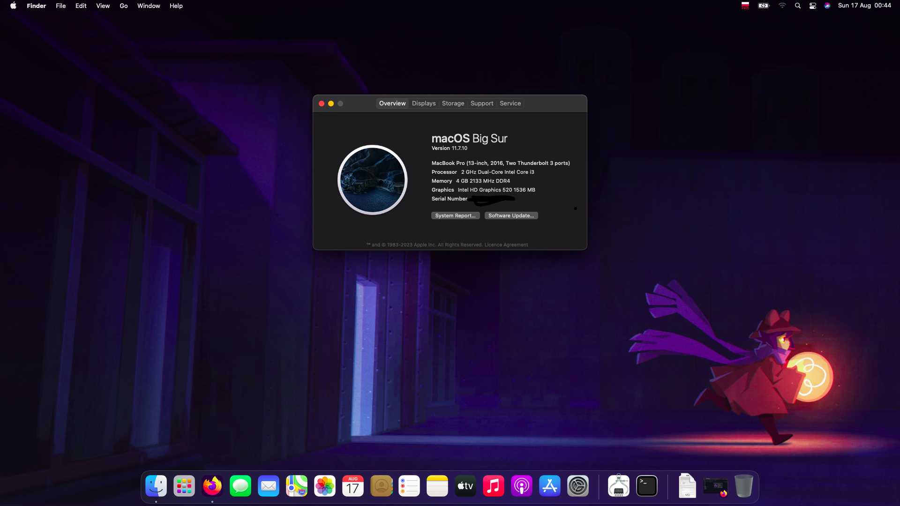
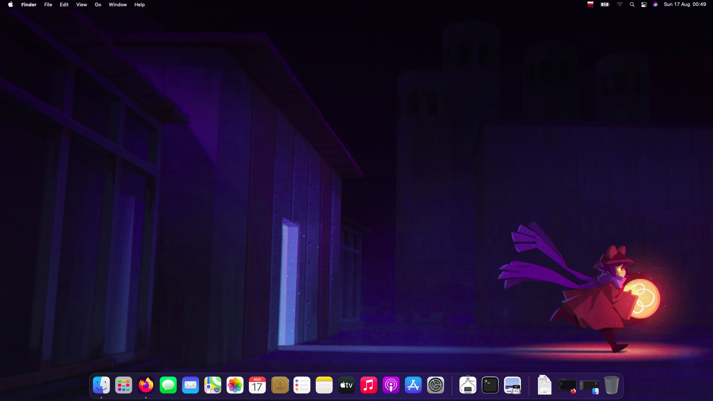

# Asus-Notebook-R541U-Hackintosh

Made With OpCore-Simplified

# Specification:

| Components.      | Model.                                 |
| ---------------- | -------------------------------------- |
| Notebook         | ASUS Notebook R541UJ                   |
| CPU              | Intel Core i3 6006U                    | 
| iGPU             | Intel® HD Graphics 520                 |
| Audio            | Realtek ALC256                         |
| LAN              | Realtek RTL8402                        |
| RAM              | 4 GB DDR4 2133 Mhz or more depends on your pc|
| SSD              | your model                             |
| SMBIOS           | MacBookPro13,1                         |
| Bootloader       | OpenCore 0.8.8                         |

## Read:
THIS IS ONLY FOR BIG SUR!

## NOTES:
Im Incuding drivers for usb tethering

## IMPORTANT!!!
MAP YOUR USB PORTS WITH:
USBTOOLBOX
After you do it you will get: USBMAP.kext
drop the kext into kexts
after that open propertree
open config.plist
crtl+r on keyboard
select oc folder
click crtl+s
DONE

# BIOS Settings

Before the setting, load default settings

## Enable:
- Intel Virtualizzation Technology
- DVMT Pre Allocated --> 64MB

## Disable:
- VT-d
- Fast Boot *works for me turned on*
- CSM Support
- Secure Boot Control

# Devices Screenshots

# What works and what doesn't:
- [x] Intel® HD Graphics 520 iGPU
- [x] Realtek ALC256 Internal Output
- [x] Realtek ALC256 HDMI Audio Output
- [x] USB Ports
- [x] Realtek RTL810xE
- [x] NVRAM
- [x] Boot Windows By OpenCore
- [x] SD Card Reader (works)
- [ ] NVIDIA® GeForce® 920M
- [ ] WiFi + Bluetooth (you can replace the card with a compatible one recomended AzureWave AW-CE123H)

## Credits

- [Acidanthera](https://github.com/acidanthera) for OpenCore Bootloader
- [Apple](https://apple.com) for macOS
- [Dortania](https://github.com/dortania) for OpenCore Guides
- [OpCore-Simplify](https://github.com/lzhoang2801/OpCore-Simplify) Made Efi
- i stole readme from [SASA-Tech](https://github.com/SASA-Tech/Asus-VivoBook-R541U-Hackintosh/tree/main)
